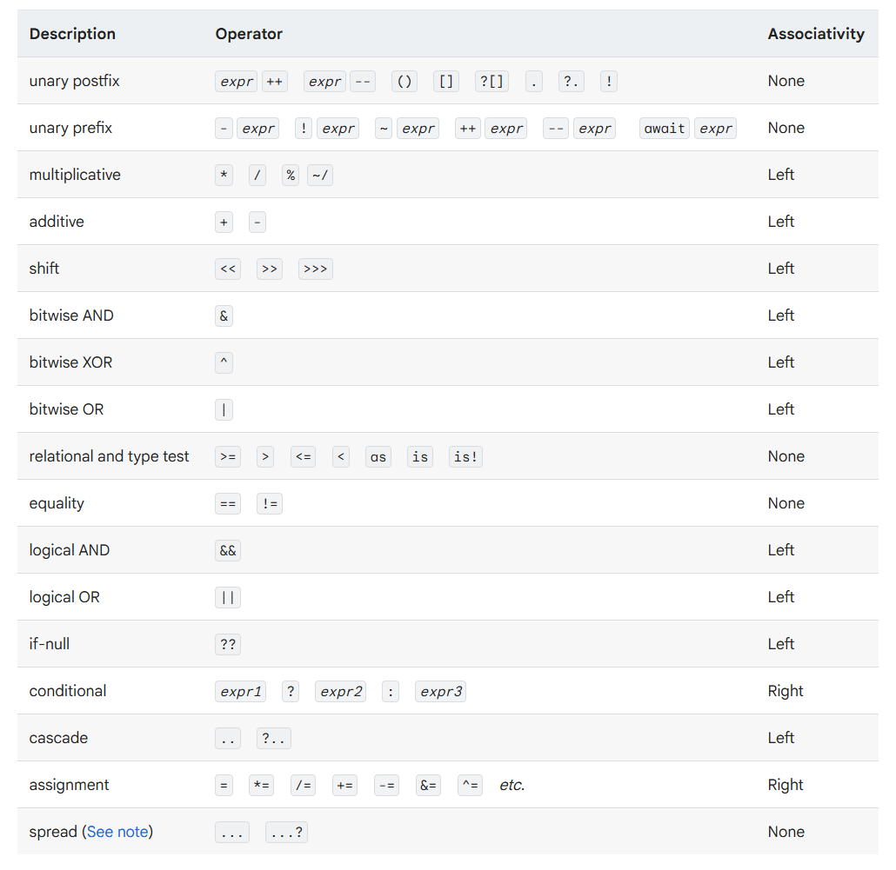
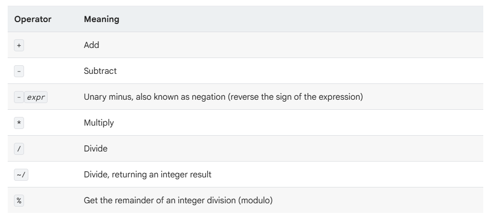
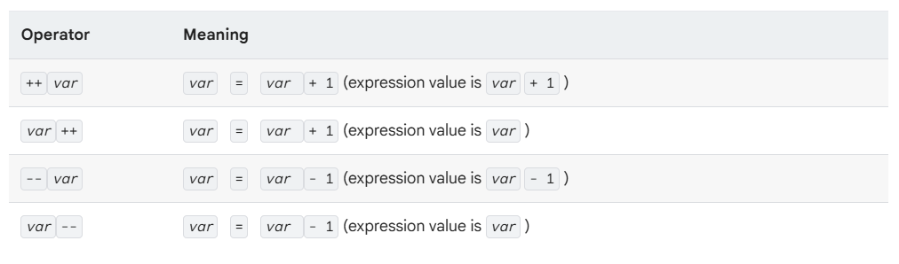

# Day 02: Operators & Logic

## 1. Operator precedence (Thứ tự ưu tiên của toán tử)

## 

- in the operator table, each operator has higher precedence than the operators in the rows that follow it.
  - For example: the multiplicative operator `%` has higher precedence than (and thus executes before (được thực thi trước)). the equality operator `==`, which has higher precedence than tho logical AND operator `&&`.
  - **_Warning_** : for operators that take two operand(toán hạng), the leftmost operand determines which method is used.

## 2. Arithmetic operators (Toán học)

## 

- `/`: Chia bình thường, kết quả luôn là double
- `~/`: Chia lấy phần nguyên (Integer Division). Kết quả là int
- `%` : chia lấy dư (modulo)

- Dart also supports both prefix and postfix increment and decrement operators.

## 

## 3. Type test operators (Kiểm tra kiểu)

- The `as`, `is`, and `is!` operators are handy for checking types at runtime.
  - `is`: True if the object has the specified type (kiểm tra xem biến có phải kiểu này không ? "trả về `true`/`false`").
  - `is!`: True if the object dosen't have the specified type (kiểm tra biến không phải kiểu này).
  - `as` : Typecast (ép kiểu).

## 4. Assignment operators (Gán giá trị)

### 1. Basic Assignment (Gán cơ bản)

- you can assign values using the `=` operator.
  - ex: a = value.
- To assign only if the assigned-to variable is null, use the `??=` operator.
  - ex:
    String? userColor; // Người dùng chưa chọn (null)
    // Nếu userColor null, gán là 'Blue'. Nếu đã chọn rồi thì giữ nguyên.
    userColor ??= 'Blue';

### 2. Compound Assignment (Gán kết hợp)

- Compound assignment operators such as `+=` combine an operator with an assignment.

- compound assignment operators work:

  - `+=` `a = a + b` Cộng thêm vào rồi gán lại.
  - `-=` `a = a - b` Trừ đi rồi gán lại.
  - `_=` `a = a _ b` Nhân lên rồi gán lại.
  - `/=` `a = a / b` Chia rồi gán lại (kết quả double).
  - `~/=` `a = a ~/ b` Chia lấy nguyên rồi gán lại (kết quả int).

- Lưu ý: Các toán tử Bitwise (`&=`, `|=`, `^=`, `<<=`, `>>=`) cũng hoạt động tương tự nhưng ít dùng hơn.

## 5. Logical operators

- you can invert or combine boolean expressions using the logical operator.
  - ` !``expr ` invents the following expression(biểu thức) ( changes false to true, and vice versa (ngược lại)).
  - `||` logical OR
  - `&&` logocal AND

## 6. Bitwise and shift operators

- Dành cho xử lý dữ liệu cấp thấp (Binary), mã hóa, IoT hoặc màu sắc.
  - `&` (AND), `|` (OR), `^` (XOR), `~` (NOT).
  - `<<` (Shift Left), `>>` (Shift Right).
    Flutter: Thường dùng để xử lý mã màu Hex ARGB. Ví dụ tách kênh Alpha từ màu

## 7. Conditional expressions

- Dart has two operators that let you concisely evaluate expressions(xét biểu thức một cách ngắn gọn) that might otherwise require if-else statements:
  - ` conditon``?``expr1 `:`expr2`
    if condition is true, evaluates expr1 (and returns its value); ortherwise, evaluates and return the value of expr2.
  - ` expr1``??``expr2 `
    if expr1 is non-null, return its value; ortherwise, evaluates and return of expr2.

## 8. Cascade notation

- ## Cascades (`..`,`?..`) allow you to make a sequence of operation(chuổi thao tác) on the same object.
  - `..`: Cascade thường.
  - `?..`: null-shorting cascade (nếu đối tượng null thì không làm gì, tránh crash).

## 9. Spread operators

- Spread operators evaluate an expressopn that yields a collection(biểu thức trả về 1 tập hợp), unpacks the resulting values, and inserts them into another collection
- **The Spread operator isn't actually an operator expression**. The `...`/`...?` syntax is part of the collection literal itself(1 phần cú pháp tập hợp).

  `...`: Spread thường.

  `...?`: Null-aware spread (Nếu List con bị null thì bỏ qua, không thêm vào).

## 10. Other operators

- Những ký tự đặc biệt nhưng có chức năng toán tử.

  - `()`: Gom nhóm ưu tiên, gọi hàm.

  - `[]`: Truy cập phần tử mảng/map (list[0]).

  - `?[]`: Truy cập mảng an toàn (list?[0]).

  - `.`: Truy cập thuộc tính (obj.name).

  - `?.`: Truy cập thuộc tính an toàn (obj?.name).
